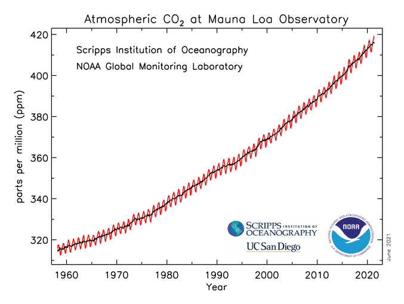

 

### Welcome! My name is Carter Coleman and I am a PhD student at the University of Georgia, Department of environmental Health Science. This Site serves as an open-source repository for all the data I worked with through my graduate program. 

 
 
 
 

#### Professional Background
I am a UGA Alumnus, receiving my undergrad in Ecology from the Odum School of Ecology. My specific background is in aquatic ecosystem ecology, focusing on nutrient cycling in freshwater systems. Additionally, I worked for 2.5 years as a an education/outreach and landfill methane collection system monitoring intern for Athens-Clarke County Solid Waste.

Following graduation, I joined an environmental engineering and consulting firm iun New Jersey, where I served as a liaison to insurance companies regarding how to remediate petroleum/hard water releases and mold growth remediation.

As I mentioned, I am currently a PhD student the UGA Department of Environmental Health Science. I am broadly interested in studying chemical interactions with waterborne pathogens and how they effect pathogen emergence.  

 

#### Stats/Coding
So far, most of my statistical experience comes from using Excel in my upper level, undergraduate ecology labs. I am most comfortable with basic methods like T-tests, Linear Regression, ANOVA, etc. However, I am familiar with higher-level analyses like Principle Component Analysis.

My coding experience is exclusively in R and comes from taking Population and Community Ecology with Dr. John Drake and Dr. Andrew Park. This course covered RStudio basics and simple population statistics in R.

From this course, I would like to become proficient enough in R to comfortably analyze my data during my graduate degree. This would mean being comfortable with R syntax, creating and sharing data/markdowns, and learning higher-level statistical methods.  

 

#### Fun Fact
I was once featured on my previous company's monthly meeting because I helped respond to an ignited gas station underground storage tank during removal. Luckily no one was hurt and we were able to extinguish the fire with a fire extinguisher onsite. 

 

 <h2>A Quick Look at Climate Science!</h1> 

 

##### The Keeling Curve

A fundamental data-set that first tipped scientist off about the climate change we are likely experiencing now were collected by Scripps’ scientist Charles David Keeling. On-site  measurements of carbon dioxide at the NOAA weather station on Mauna Loa started in 1958 and continues to be collected today! This data set is to foundation of our understanding that CO2 concentrations are continuing to increase, thus increasing the greenhouse effect the Earth experiences. Check out the link below for more details!

[NOAA Research News.](https://research.noaa.gov/article/ArtMID/587/ArticleID/2764/Coronavirus-response-barely-slows-rising-carbon-dioxide)

 

